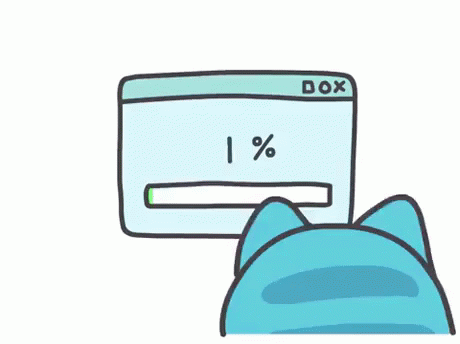

# Google Calendar Events Scheduling 

This is a simple example of how to schedule events in Google Calendar using Python.

## Usage

To use this template, you can use the following command:

```bash
pip install sayvai-tools
```

# Requirements

- python 3.8 or higher
- pip
- sayvai-tools
- Google Calendar API credentials

# Installation

first you need to install the sayvai-tools package using pip:


```bash
pip install sayvai-tools
```
or 

```bash
pip install git+https://github.com/Sayvai-io/custom-tools.git
``` 
🌍 now we have to login to google workspace and get GOOGLE CREDENTIALS API 

- Go to the [Google Calendar API](https://developers.google.com/calendar/api/guides/overview).
- Click on the "Enable the Google Calendar API" button.
- Create a new project.
- Click on the "Create credentials" button.
- Select "Google Calendar API" and "Other non-UI (e.g. cron job, daemon)".

